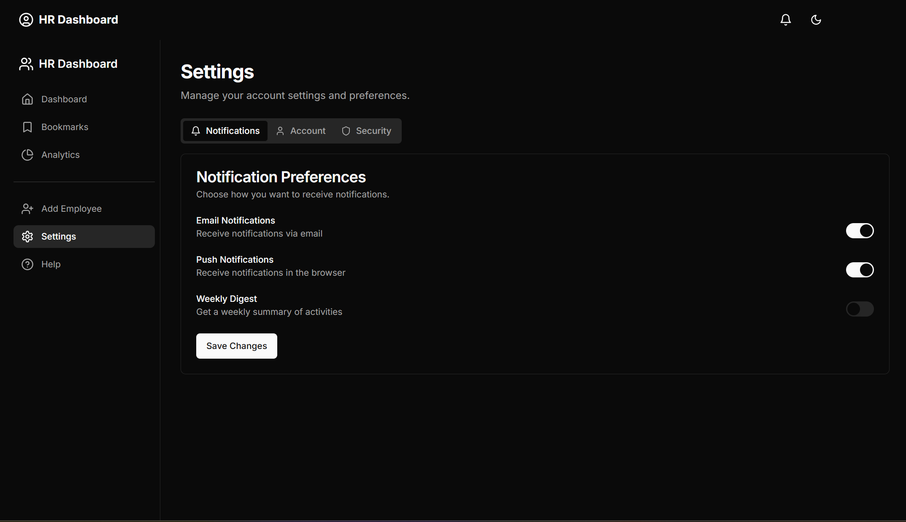

# 💼 HR Performance Dashboard (Advanced)

 
 


A modern HR dashboard built using **Next.js App Router**, **Tailwind CSS**, and **Context API** to help HR managers track employee performance, manage bookmarks, and view visual insights.

---

## 🧪 Setup Instructions

1. **Clone the repository:**

```bash
git clone https://github.com/rajsekhar77/HR-Dashboard.git
```
2. **Install Dependencies:**

```bash
npm install
```

3. **Run the development server:**

```bash
npm run dev
```
Visit: http://localhost:3000

---

## 🚀 Features

### ✅ Core Pages

#### 🏠 Dashboard Homepage (`/`)
- Fetch employees from `https://dummyjson.com/users?limit=20`
- Cards show full name, email, age, department
- Performance rating bar (1–5 stars)
- Actions: `View`, `Bookmark`, `Promote`

#### 🔍 Search & Filter
- Search by name, email, or department (case-insensitive)
- Multi-select filters: department & rating

#### 👤 Employee Details (`/employee/[id]`)
- Dynamic routing for each employee
- Tabbed sections: Overview, Projects, Feedback
- Shows contact info, performance, feedback badges

#### 📌 Bookmark Manager (`/bookmarks`)
- View bookmarked employees
- Remove bookmarks or simulate "Promote"/"Assign"

#### 📊 Analytics (`/analytics`)
- Department-wise rating chart
- Bookmark trends (mocked)
- Includes skeleton loaders and responsive graphs

#### ➕ Add Employee (`/add-employee`)
- A mock form UI to create a new employee
- Includes basic **form validation** (e.g., required fields, email format, etc.)
- No actual API integration — designed for **UI demonstration** only

#### ⚙️ Settings Page (`/settings`)
- Mock **Change Password** form
- Includes:
  - Old Password
  - New Password
  - Confirm Password fields
- Basic frontend validation to ensure fields match and meet criteria
- Purely UI — no real authentication logic implemented

---

## 🛠️ Tech Stack

| Tool               | Purpose                          |
|--------------------|----------------------------------|
| **Next.js** (App Router) | Frontend Framework             |
| **Tailwind CSS**        | Styling (Dark/Light mode)      |
| **Recharts** | Data visualization         |
| **Context API**         | State management               |
| **lucide-react**         | Icons               |
| **JavaScript (ES6+)**   | Core logic                     |

---

## 📸 Screenshots

I have saved all project screenshots inside the `public/screenshots/` folder.

### Dashboard View


### Employee Detail Page


### Analytics Page


### Add-Employee Page


### Settings Page



---

🧑‍💻 Author
Built with ❤️ by Rajsekhar
